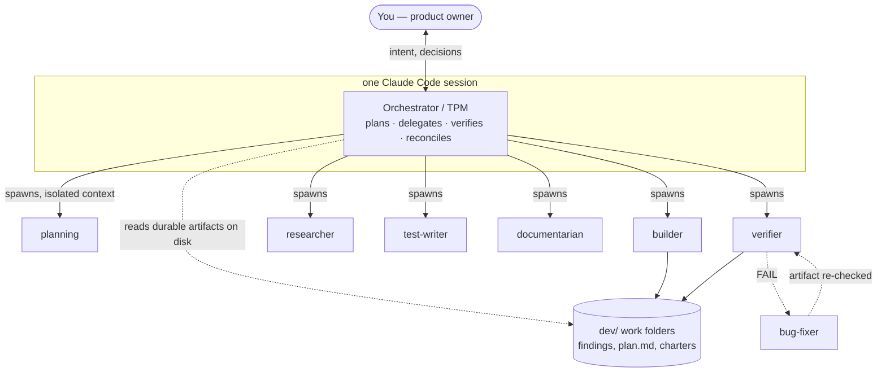
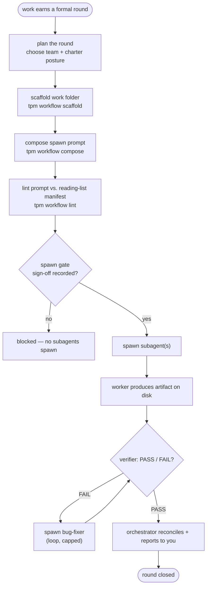
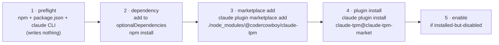

# claude-tpm — technical details

This is the deep dive: the innards of claude-tpm for anyone who's curious how the thing actually works, not just how to run it. If you just want to install it and go, the [README](../README.md) and [`docs/INSTALL.md`](INSTALL.md) have you covered. This one is about *why* it's shaped the way it is.

Note: **Claude wrote nearly all of this code and these docs.** I'm the ideas guy: I decided what it should do and why, argued with it about the design, and drove the rounds. Claude did the typing. That's not a disclaimer I'm embarrassed about; it's kind of the whole point of a tool that turns Claude into a disciplined engineering team.

A couple of expectation-setters before the deep dive:

- **This is a personal tool, v0.1.0.** Mac-first, works-on-my-machine energy. It's a methodology I lifted out of months of real use, not a product with a support line. I haven't tested it across a matrix of operating systems, so if you're on Linux or Windows, you're a little further out on the frontier than I am.
- **Distribution is GitHub, not the npm registry.** claude-tpm installs from GitHub - as a project dependency (`npm install github:codercowboy/claude-tpm`) or from a local clone you point at your projects. There's no published `@codercowboy/claude-tpm` on the public npm registry, so nothing below assumes you can install it from there.

---

## The 10,000-foot view

claude-tpm turns a single [Claude Code](https://claude.com/claude-code) session into a small, disciplined engineering org. One session, the **orchestrator**, plays the role of a Technical Program Manager: it takes intent from you (the product owner), decomposes the work, delegates pieces to **subagents** running in their own isolated contexts, verifies what comes back, integrates it, and reports up. The name is the role on purpose: a TPM.

The whole thing is a [Claude Code plugin](https://docs.claude.com/en/docs/claude-code/plugins) that grafts onto a project you *already have*. It doesn't scaffold a new repo. After install, a plain `claude` in your project gets the `/tpm-session`, `/tpm-task`, `/tpm-workflow` (and friends) slash commands live from message #1. Alongside the plugin ships a small, dependency-free `tpm` command-line tool that does the plumbing the skills lean on.



The rest of this doc walks the pieces: the roles and the discipline that keeps them honest, how work flows through a round, the `tpm` CLI architecture, the module model, the plugin/marketplace mechanics, the hooks, and finally the dependency and toolkit breakdown.

---

## Components & roles

### The orchestrator (the TPM)

The orchestrator is the session you actually talk to. It's the only actor that's user-facing, so it's the only one that can be *corrected* mid-flight: you redirect it, it self-corrects. Its job is planning, delegating, reconciling, and talking to you. It does the legwork itself only for lightweight, direct work; anything that earns a formal round gets handed to subagents.

### The subagents (the workers)

Subagents run in their own isolated contexts and never see you directly. claude-tpm ships **seven subagent types**, each a distinct role:

| Type | What it does |
|---|---|
| `planning` | Formalizes the ask, surfaces risks and open questions, proposes a plan. Doesn't build. |
| `builder` | Produces the working artifact. |
| `test-writer` | Adds tests to already-delivered code. |
| `documentarian` | Adds docs to already-delivered code. |
| `verifier` | Independently inspects the artifact and returns PASS/FAIL. |
| `bug-fixer` | The loop's fixer - spawned only when a verifier fails something. |
| `researcher` | Pulls information together (recon, fact-finding), rather than building. |

The `bug-fixer` is the odd one out: it's in **no team roster**. It only exists inside the verify loop, spawned to fix whatever a verifier just failed. More on that below.

### Asymmetric trust — the design principle underneath the roles

Here's the counterintuitive part. claude-tpm trusts its actors *unequally*:

- The **orchestrator** is user-facing and self-correcting. You can see what it's doing and steer it, so its own self-verification can be light. Policing it heavily would just be friction.
- The **subagents** are user-invisible. You never watch them work. So the orchestrator keeps a critical eye on *their* output: trust-but-verify, the classic verifier pattern.

The rule of thumb: **police the orchestrator↔subagent boundary, not the user↔orchestrator one.** Verification exists because the work happened somewhere you couldn't see it.

### Charters — a per-round posture, kept secret

A **charter** is a subagent role's singular definition of "done." A round runs under exactly one of two *postures*, and the charter carries it:

- **Shipping charter** - the goal is a working artifact. Build the thing, make it run.
- **Research charter** - the goal is durable knowledge. Produce findings someone can trust later.

Exactly one charter is pasted into every round's `plan.md`. **Never both.** **A worker must never learn that the other posture exists.** That's "charter secrecy."

*Awareness is behavior.* A builder that knows "research mode" is a thing it could be in will occasionally hedge, over-document, or reach for the wrong shape of output. A worker that has only ever heard of shipping just ships. The charter registry (which postures exist, which role gets which) is orchestrator-side knowledge. The worker sees one charter and nothing else. (This is the same idea as module opacity, one level down: a posture you can't see is a posture you can't drift into.)

The eight shipped charter files live at `claude-context/methodology/workflow-setup/charters/`: one each for `planning`, `shipping`, `test-writer`, `documentarian`, `verifier`, `bug-fixer`, `research`, plus an `mvp` charter. Each well-known role ships with exactly one charter, which is why there's no "pick a charter" question at round time. The roster just displays what each role gets. If you want a lower bar for a specific round, you edit that round's *copied* charter in its work folder; the canonical file stays pristine.

### Reading lists as the single source of truth

Every actor's context is expensive, so what each actor reads is defined *once*, in a manifest, not scattered across prose that inevitably drifts. Two reading lists own it:

- **`orchestrator/reading-list.md`** - the orchestrator's session-open reading chain, including the orchestrator-only docs (the ones that carry the two-charter knowledge).
- **`subagent/reading-list.md`** - the subagent's step-zero chain: a base set plus conditional blocks per spawn flavor (resume / shipping / live-system / verifier).

The honor-system fence is the payoff: **subagents read only the subagent list.** The orchestrator list carries project-management knowledge (most importantly, that two charters exist) that would mislead a worker. It's a fence, not access control.

What keeps the fence from rotting: `tools/workflow/tpm-workflow-lint-subagent-prompt.js` **parses the subagent reading list directly.** The linter that enforces what a spawn prompt may reference reads the same manifest the humans read. Docs and enforcement literally can't drift, because they're the same file. That's the whole "single source of truth" thing made real rather than aspirational.

---

## Data flow — the round/epic lifecycle

"Just answer a question" or "make a quick edit" doesn't go through any of this. That's **low ceremony**: the orchestrator just does it. The machinery below is **triggered, not boot-default**: it fires only when a piece of work earns a formal round.

When a round *is* earned, here's the shape:



A few things worth unpacking:

**Teams are ordered rosters.** claude-tpm ships six built-in teams, and the array order *is* the run order:

| Team | Shape (run order) | When |
|---|---|---|
| `full` *(default)* | planning → builder → test-writer → documentarian → verifier | the complete separated-concerns round |
| `ship` | builder → verifier | builder wears all hats, then verify |
| `build` | builder | a quick, unverified build |
| `test` | test-writer → verifier | add tests to delivered code |
| `docs` | documentarian → verifier | add docs to delivered code |
| `research` | researcher | a one-off info-gathering pass |

Note that `research` is a standalone one-off, *not* a planner-for-a-builder. A planner structures work; a researcher pulls info together. They're different jobs and claude-tpm keeps them separate.

**The verify↔bug-fixer loop.** Any team with a verifier gets it. On a FAIL, the orchestrator spawns a `bug-fixer` (that's the `verifier.loopFixer`, default `bug-fixer`) to fix the artifact, then re-verifies. It loops until PASS or until it hits `verifyLoopCap` (default **5**). Verification is AND-semantics by default: *every* verifier must PASS or it's a kickback (`verifier.requireAllPass`).

```
   ┌─────────────┐   FAIL   ┌─────────────┐
   │  verifier   │─────────▶│  bug-fixer  │
   │ (read-only) │◀─────────│  (fixes)    │
   └──────┬──────┘  re-check└─────────────┘
          │ PASS                 ▲
          ▼                      │  bounded by verifyLoopCap (default 5)
     reconcile                   └── if the cap is hit, the loop stops and escalates
```

**The verifier can't cheat.** There's a HARD RULE, enforced in `verification.md` and the lint: a verifier inspects **only on-disk artifacts** and never touches the live system under test. It can't mutate what it's checking, which is the only way a PASS means anything. A verifier that could edit the thing it's verifying would just be a second builder.

**How work partitions - "trains."** The per-round default parallelism is `serial` (one team finishes before the next starts). The other modes are `user-dictated` (you lay out the ordering in the plan discussion) and `orchestrator-optimized` (the orchestrator schedules for throughput within the dependency graph). In real use, the shape that emerges is **parallel "trains"**: each train is one feature's pipeline of teams running *serially* (team → team → team), while multiple trains run *in parallel* with each other. Parallelism is opt-in through the plan, not something the framework forces on you.

**Standing deliverables.** A round produces a few standing outputs, all on by default: `findings/TLDR.md` (the narrative for you), `findings/tool-feedback.md` (a friction log), and `findings/wiki.md` (a long-form writeup, research charter only).

**Blocked filenames.** A subagent's `.md` deliverable name is *rejected server-side* if it matches `report`, `summary`, `analysis`, or `findings` (as a standalone deliverable name). `tools/workflow/tpm-workflow-check-filename.js` enforces it. The reason is that those generic names are what a model reaches for when it's producing filler; forcing a specific, honest filename is a nudge toward specific, honest content.

---

## The `tpm` CLI architecture

The skills are the brains; the `tpm` command-line tool is the hands. It's a Node program (the package `bin` is `tpm` → `tools/tpm.js`), and its architecture is simple.

### A simple top dispatcher → per-suite routers

`tools/tpm.js` is a **simple top dispatcher**, git-style. It knows only *suites*, not verbs. When you run `tpm <suite> <verb> [args…]`, it forwards `<suite>` plus everything after it, verbatim, to that suite's own router (`tools/<suite>/tpm-<suite>-router.js`), which owns its verb table. Adding or renaming a verb never touches `tpm.js`.

```
  npx tpm <suite> <verb> [args…]
          │
          ▼
   tools/tpm.js   ── the DUMB top dispatcher (knows SUITES only)
          │  spawnSync('node', [router, ...everything-after], {stdio:'inherit'})
          │
          ├── session   → tools/session/tpm-session-router.js   (config · current · notes · review)
          ├── task      → tools/task/tpm-task-router.js          (add · list · show · … · config)
          ├── workflow  → tools/workflow/tpm-workflow-router.js   (scaffold · compose · lint · audit · cost · signoff · doctor · …)
          └── hooks     → tools/hooks/tpm-hooks-router.js         (gate-spawn)

   flat consumer aliases (NOT suites — they map straight to a script):
          ├── install    → tools/consumer/tpm-consumer-install.js
          ├── uninstall  → tools/consumer/tpm-consumer-uninstall.js
          └── doctor     → tpm-consumer-install.js  (with --check appended: doctor IS install --check)
```

Dispatch happens by **child process** (`spawnSync('node', …, {stdio:'inherit'})`) with faithful argv/stdio pass-through, and the child's exit code is propagated up. Unknown command → exit 2 plus the menu; bare `tpm` or `--help` → menu, exit 0.

The four suites are `session`, `task`, `workflow`, and `hooks`. On top of those sit three flat, human-facing porcelain aliases (`install`, `uninstall`, `doctor`) because "graft this onto my project" and "check my install" are things a *person* types, not a suite/verb pair. `doctor` is literally `install --check` with the flag injected by the dispatcher.

> **A doc-map note:** there are two tool docs in the tree. `tools/README.md` is the self-titled canonical tool ledger - the exhaustive index of every tool that ships. `tools/tpm.md` is the narrower reference for the `tpm` dispatcher itself (the two-level model, the suite/verb tables, exit codes). Both cover the four suites (`session` / `task` / `workflow` / `hooks`) plus the `install` / `uninstall` / `doctor` aliases; **if they ever disagree, `tools/README.md` wins.**

### Self-locating, no environment variables

The design goal that shapes all of this: **nothing in the `tpm …` chain needs `%TPM_HOME%` or any env var.** Every router self-locates its own scripts relative to `__dirname`. You can run `npx tpm …` from anywhere, in any consumer project, and it finds its own pieces. No setup step, no shell rc edits, no "did you export the path?" support questions. The one place a `%TPM_HOME%` placeholder *does* appear is in read-path references inside spawn prompts and skills, and resolution there is **anchor-first**: a reader runs `npx tpm resolve-home` once, treats the printed absolute path as `%TPM_HOME%`, and resolves any `%TPM_HOME%/…` reference against it — no hook required (see [Hooks](#hooks) below).

---

## The module model

Capabilities in claude-tpm are **modules**, and the activation model is opt-*out*, not opt-in: everything is ON by default, and a project *disables* what it doesn't want. The documented modules:

- **`session`** - session notes + the boot ritual.
- **`workflow`** - the formal multi-agent round engine described above.
- **`tasks`** - the lightweight task ledger.
- **`hygiene`** - periodic project-wide drift sweeps. **Planned, not fully shipped.** Its config is still being finalized and no hygiene doc directory ships in the bundle yet. Don't count on it working today.
- **`motd`** - a boot greeting. Named in the design, but there's no config section or shipped implementation for it yet. Treat it as **planned**.

Config lives in one file: **`.claude/claude-tpm/config.json`**, versioned (`"version": 1`). Every module ships with sensible built-in defaults, so an *absent* config file (or an absent section) just means "use the defaults." You only add config to *change* something. (The installer does not create the file. The full schema is documented in the [config guide](config-guide.md).)

### Module opacity

"A disabled module costs zero context" sounds like a nice-to-have. It does more than that.

Module opacity means a disabled module leaves **no residual awareness** of its concept in the orchestrator's context: not a stray mention, not a cross-reference, not a "when you're running a workflow…" aside buried in an always-loaded doc. If a project disables `workflow`, its orchestrator should operate as though formal rounds, charters, and verifiers *are not a thing that exists.*

The test is concrete: with a module OFF, walk the orchestrator's entire live reading chain. The disabled module's vocabulary ("charter," "workflow round," "verifier," "pre-task questions") should not appear *anywhere* in it. If it does, that's a leak to fix.

That test has a real design consequence: **core/shared docs must be module-agnostic.** A doc on the always-on core list may describe only module-agnostic ground: the orchestrator's identity, its read/write boundaries, shared conventions. Every reference to a specific optional module moves *into that module's own docs*, which load only when it's enabled. This is why the orchestrator handbook gets carved up: its general job description stays core, but its charter/pre-task/plan-review material moves into the `workflow` module, so a workflow-disabled orchestrator never reads the word "charter."

And the reason it matters beyond saving tokens: **awareness is behavior.** An orchestrator that *knows* charters exist reaches for them. One that has never heard of them just operates. Clutter isn't only cost, it's unwanted capability bleeding into a context that opted out.

> **A couple more planned-not-shipped references** you may spot if you read the methodology docs closely: `workflow-setup/prompt-templates/` (reusable spawn-prompt skeletons) and `docs/CONSUMER-QUICKSTART.md` are both referenced in the methodology inventory but **aren't in the shipped bundle** yet. They're aspirational pointers, not working paths. Don't follow them expecting to find something.

---

## Plugin + marketplace mechanics

claude-tpm installs as a Claude Code plugin, and the `tpm install` CLI wires up the whole chain for you so you don't have to hand-run the `claude plugin` commands.

The pieces:

- The **plugin** is named `claude-tpm` (`.claude-plugin/plugin.json`). Its manifest points at the skills directory (`"skills": ["./.claude/skills"]`), which is how the six `tpm-*` skills become live slash commands, and the bundle-root `hooks/hooks.json` carries the plugin's own PreToolUse hooks.
- The **marketplace** is named `claude-tpm-market` (`.claude-plugin/marketplace.json`, owner `codercowboy`). A marketplace is Claude Code's mechanism for making a plugin installable; claude-tpm ships its own single-plugin one.

The installer (`tools/consumer/tpm-consumer-install.js`) runs a **check-then-act, idempotent, 5-step flow**, all scoped `--scope project`:



The important restraint: **the installer never authors your project files** (`package.json`, README, LICENSE, `.gitignore`) and **never edits your `settings.json`.** The plugin carries its own hooks, so there's nothing for you to hand-wire. It's also interactive by default: it prints the exact command it's about to run and asks before changing anything.

The `tpm uninstall` reverses all of it (plugin uninstall → marketplace remove → drop the dependency) and is **scope-aware**, because the plugin and marketplace are machine-global singletons: it asks whether you mean *this project only* (disable here, drop the dep, leave the shared marketplace for other projects) or *the whole system* (fully remove the plugin + global marketplace). It never deletes your files.

---

## Hooks

claude-tpm auto-wires a single [PreToolUse hook](https://docs.claude.com/en/docs/claude-code/hooks) through `hooks/hooks.json` - no hand-wiring in the consumer's `settings.json`. It's invoked by the harness under a stable, path-independent `npx tpm hooks <verb>` command, and the `hooks` suite router forwards the harness's payload/stdout/exit-code through unchanged.

- **`gate-spawn`** - matches `Agent|Task` (the spawn tools). It's the **spawn gate**: it blocks a marked subagent spawn that fails the sign-off check. This is the enforcement behind "you can't fire off a formal round without the recorded two-token sign-off." The gate reads the sign-off ledger (`tpm-workflow-signoff.js`) and refuses a marked spawn that hasn't been signed off. Script: `tools/workflow/hooks/tpm-workflow-gate-spawn.js`.

**`%TPM_HOME%` resolution is anchor-first, not hooked.** Earlier builds resolved the `%TPM_HOME%/…` bundle placeholder with a token-rewriting hook on the read family; those hooks were **retired in #1126**. Today a reader resolves the bundle explicitly: run **`npx tpm resolve-home`** (an alias of `tpm home`; self-locating from `__dirname`, works in every permission mode including `--dangerously-skip-permissions`) — the printed absolute path **is** `%TPM_HOME%`, and any `%TPM_HOME%/…` path resolves against it. `npx tpm doc <bundle-relative-path>` stays as a convenience that prints a bundle doc with its in-content tokens already resolved. This keeps the *rest* of the system env-var-free without a hook firing on every read.

---

## Dependency breakdown

### Packaged (npm) dependencies: none

**claude-tpm has zero npm dependencies.** The `package.json` declares **no `dependencies` field and no `devDependencies` field at all.** There is nothing to `npm install` transitively, nothing to audit for CVEs, no supply chain to reason about. The tool suites are written to run under a bare `node` with only Node's standard library.

That's a real feature, not an accident. Every dependency you *don't* take is a dependency that can't get compromised, abandoned, or wedged against a future Node version. For a tool whose entire job is to be trustworthy plumbing under your engineering process, "no supply chain to audit" is the property you want.

### Hard platform / engine requirements

"No npm deps" is *not* "no requirements." claude-tpm cannot function without the following, none of which show up in any package manifest, so know what you need before you start:

- **[Node.js](https://nodejs.org) + [npm](https://www.npmjs.com/)** - the `tpm` CLI is a Node program (`bin` = `tools/tpm.js`), and install drives `npm`. Both need to be on your PATH. *No minimum Node version is pinned*: there's no `engines` field and no floor declared anywhere, so I won't assert one.
- **The [Claude Code](https://claude.com/claude-code) CLI** - the whole thing rides on it. claude-tpm *is* a Claude Code plugin; without the `claude` command on your PATH there is nothing to plug into.
- **An existing project with a `package.json`** - claude-tpm grafts onto a project you already have; it won't create one. If you don't have one, `npm init -y` first.
- **A way to get the bundle** - you install from GitHub, either as a project dependency (`npm install --save-optional github:codercowboy/claude-tpm`, then `npx tpm install .`) or from a local clone you point at your projects (`git clone …/claude-tpm && npx tpm install ../my-project`). There's no npm-registry package. See [`INSTALL.md`](INSTALL.md) for both routes.

Platform-wise: it's **Mac-first with works-on-my-machine energy.** I haven't done a real cross-platform test pass, so I'm not going to claim tested Linux/Windows support. The code is plain Node with no obvious OS-specific tricks, so it *should* travel, but "should" is doing real work in that sentence.

---

## Built with

The dev/authoring toolkit, distinct from the runtime requirements above. These are the things *I* (and Claude) used to build it, not things you need to run it:

- **[VS Code](https://code.visualstudio.com)** — the editor.
- **[Node.js](https://nodejs.org)** — the runtime everything is written in. The test suite is plain `node --test` (run via `node tools/tests/run-all.js`), so there's no test framework to install.
- **[Claude Code](https://claude.com/claude-code)** — claude-tpm was built with Claude Code, and it's what claude-tpm plugs into. Fully dogfooded.
- **[git](https://git-scm.com)** — version control.
- **[npm](https://www.npmjs.com/)** — packaging and distribution (claude-tpm installs as an optional dependency and enables as a Claude Code plugin).